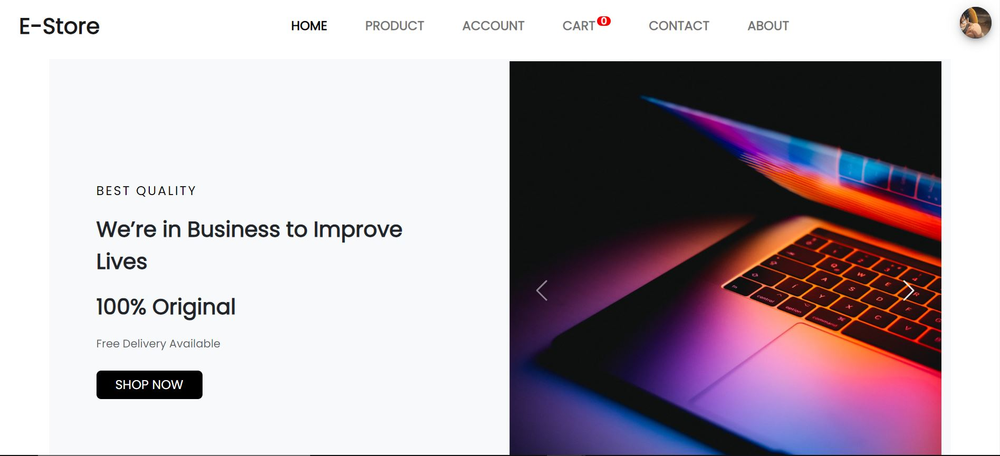
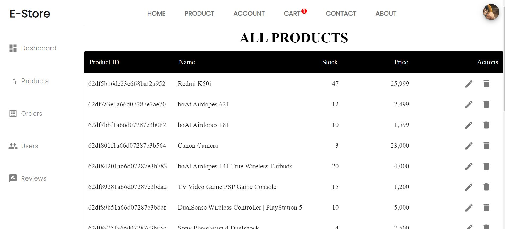
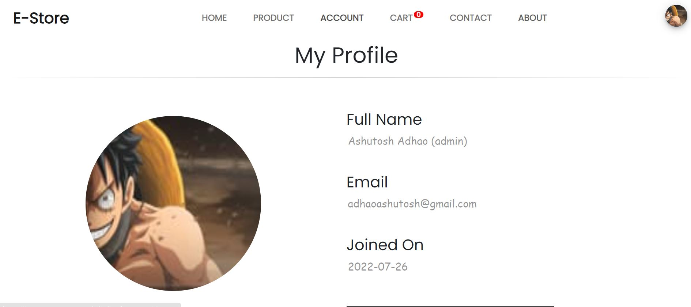
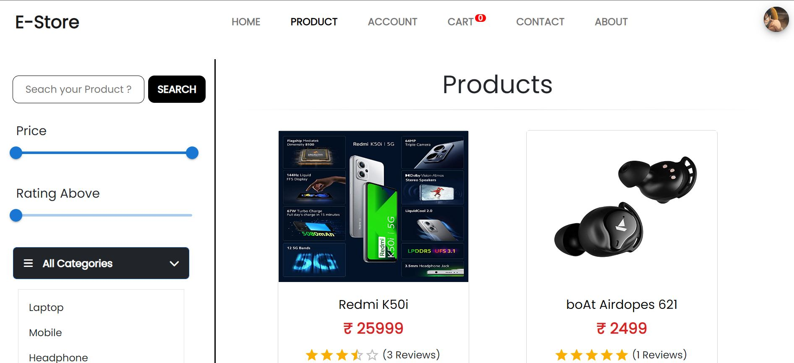
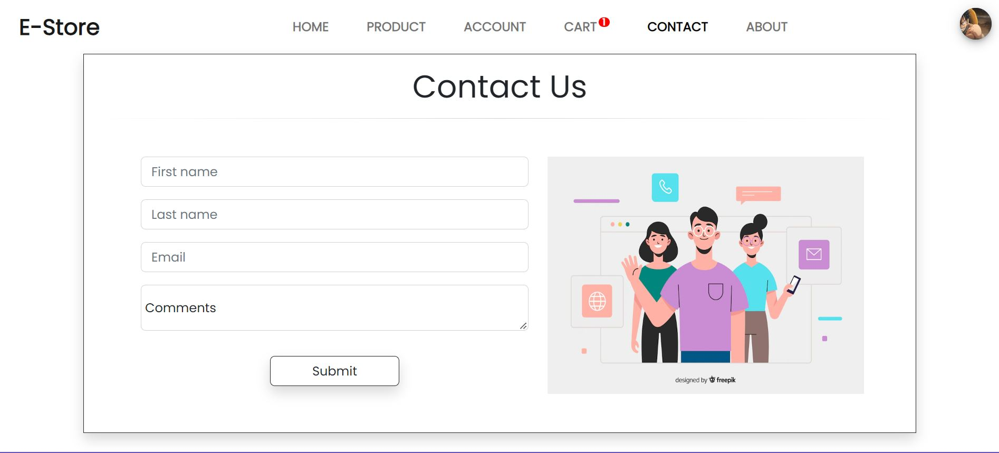
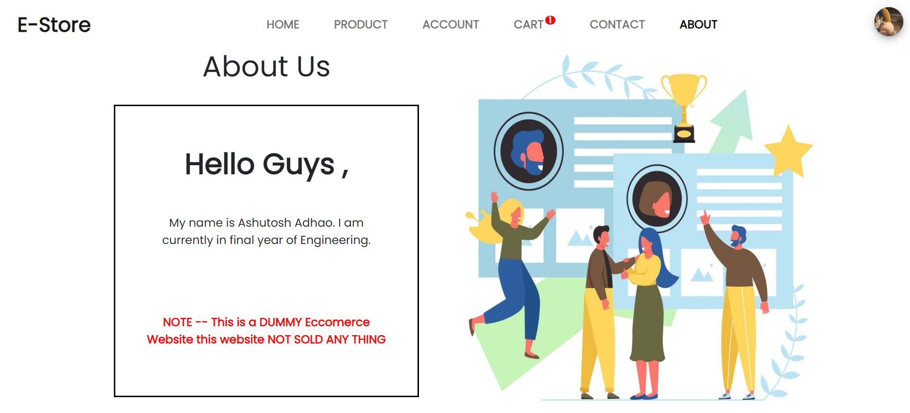
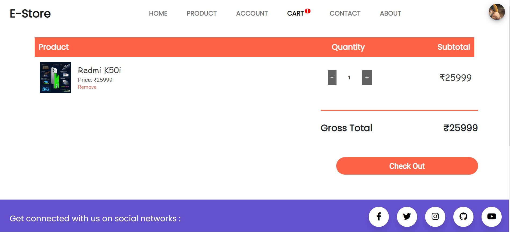
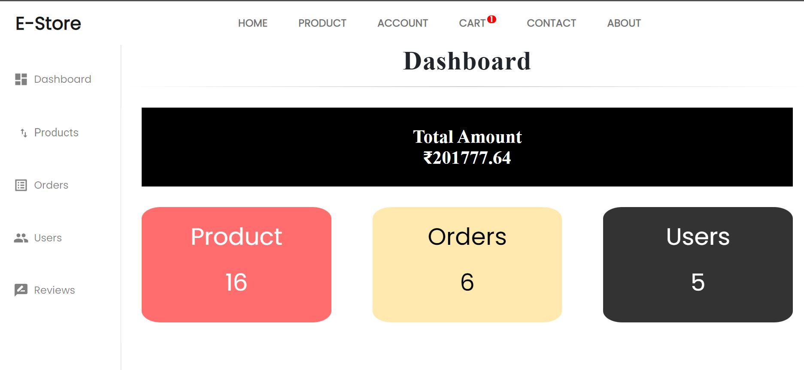
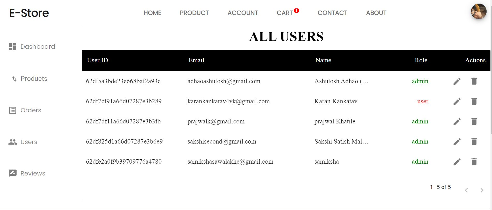

# E-Store ( ECOMMERCE Website )

This Project is made in MERN Stack ( MongoDB , Express , React ,Node ) 

**Live Link** -- https://e-store-ecommerce-website.herokuapp.com/

**See Some ScreenShots At Last** 


## Features

- Admin Section
- Dashboard to track Revenue , Stock by chart 
- Search Product
- Login User Authorization  
- Product Filter by Categories , Price Range and Rating 
- Add Review , Product , User 
- Delete Product , User , Review 
- Payment option implemented by stripe 


## Installation

Install my-project with npm

For Backend
```bash
  npm i
```
For Frontend
```bash
  cd frontend
  npm i
```

    
## Environment Variables

To run this project, you will need to add the following environment variables to your .env file

`PORT`
`DB_URI`
`STRIPE_API_KEY`
`STRIPE_SECRET_KEY`
`JWT_SECRET`
`JWT_EXPIRE`
`COOKIE_EXPIRE`
`SMPT_SERVICE`
`SMPT_MAIL`
`SMPT_PASSWORD`
`SMPT_HOST`
`SMPT_PORT`
`CLOUDINARY_NAME`
`CLOUDINARY_API_KEY`
`CLOUDINARY_API_SECRET`

fill each filed with your info respectively


## Author

Hello Guys, my name is Ashutosh Adhao, i am currently in final year you can connect me by. . .
- [LinkedIn](https://www.linkedin.com/in/ashutoshadhao/)
- [Instagram](https://www.instagram.com/ashutoshadhao/)


## Screenshots




















<!-- 


 -->


